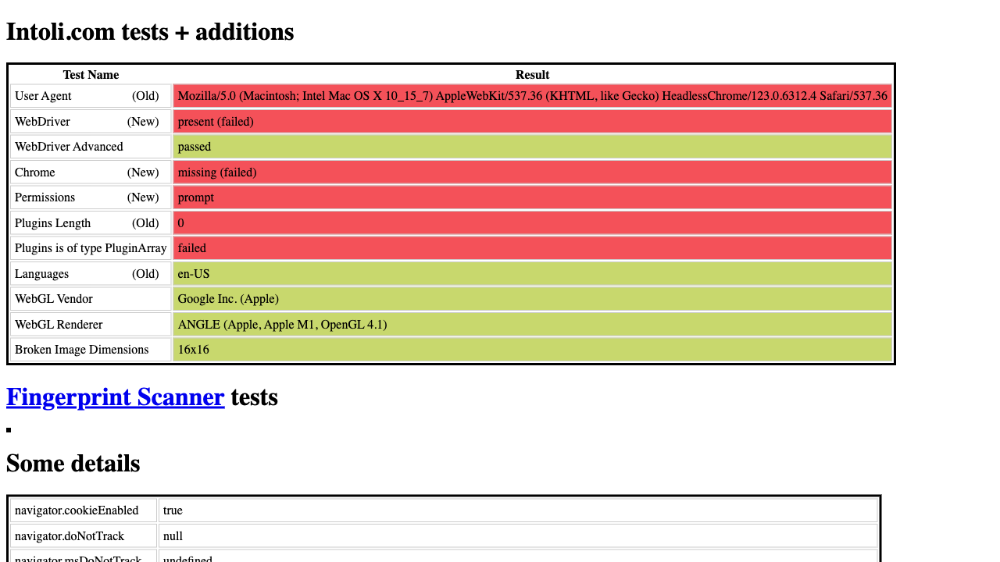
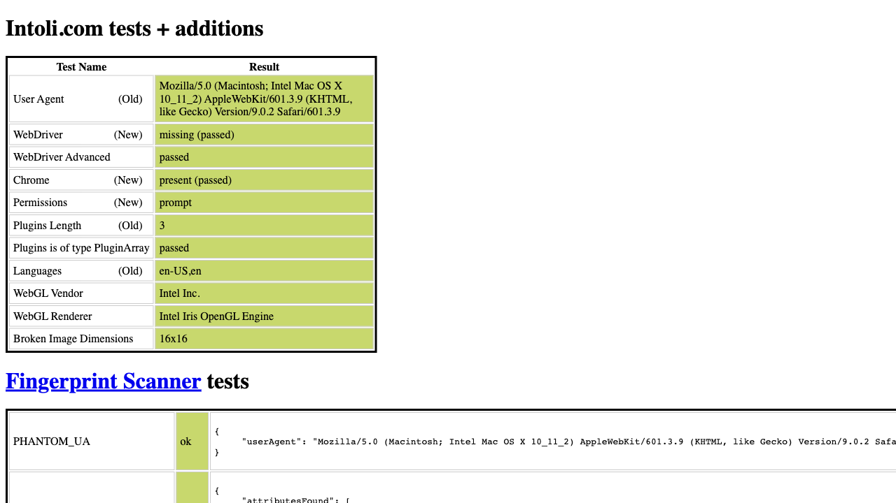

# 🥷 playwright-go-stealth

This is a simple shim to inject the [puppeteer-extra-plugin-stealth](https://github.com/berstend/puppeteer-extra/tree/master/packages/puppeteer-extra-plugin-stealth) evasions using [berstend's extraction](https://github.com/berstend/puppeteer-extra/tree/master/packages/extract-stealth-evasions) for [playwright-go](https://github.com/playwright-community/playwright-go).

| Example Comparison |
|---------------------|
| 🚨 Without the stealth script injected |
|  |
| ✅ With stealth script injected |
|  |

## Usage

```go
import stealth "github.com/jonfriesen/playwright-go-stealth"

// pass a playwright.Page and the script will be injected
err = stealth.Inject(playwrightPage)
if err != nil {
    log.Fatalf("could not inject stealth script: %v", err)
}
```

## Example

The `example/main.go` will generate two, full page screenshots showing the bot detection results. This can be run with `go run example/main.go` and the screenshots will be saved in the location you run the command from.

## Updates
The `stealth.min.js` file will be periodically updated in this repo. Further updates or specific versions are not supported or tracked at this time. However, I would accept contributions to include this functionality.

Running `make update-stealth-js` will pull the latest evasions script.

> Note: This requires `npx`.

## Additional Stealth Tips

### Disable blink automation control

```go
browser, err = m.PW.Chromium.Launch(playwright.BrowserTypeLaunchOptions{
    Args: []string{"--disable-blink-features=AutomationControlled"},
})
```

### Set a custom UserAgent
[🔗 UserAgent Repositry](https://explore.whatismybrowser.com/useragents/explore/)
```go
const userAgent = "Mozilla/5.0 (Macintosh; Intel Mac OS X 10_11_2) AppleWebKit/601.3.9 (KHTML, like Gecko) Version/9.0.2 Safari/601.3.9"
page, err := browser.NewPage(playwright.BrowserNewPageOptions{
    UserAgent: playwright.String(userAgent),
})
```

### Experiment with less common headers
```go
page, err := browser.NewPage(playwright.BrowserNewPageOptions{
    ExtraHttpHeaders: map[string]string{
        "Cache-Control":      "no-cache",
        "Sec-Ch-Ua":          `"Google Chrome";v="125", "Chromium";v="125", "Not.A/Brand";v="24"`,
        "Sec-Ch-Ua-Platform": "macOS",
    },
})
```

